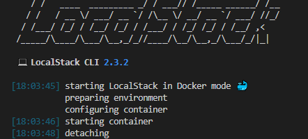
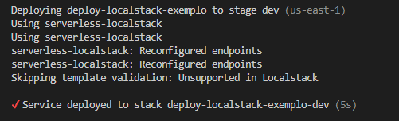
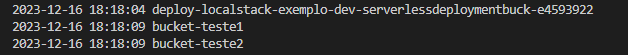

# Demonstração de deploy no localstack utilizando Serverless Framework

### Principais Tecnologias Utilizadas:
<div align="center">
  
  
  
  
</div>

### Descrição:
- O localstack é uma poderosa ferramenta que permite simular serviços da AWS, sendo que a estrutura de código para sua utilização é praticamente igual aos utilizados para IaaC na AWS.

- É possível realizar deploys de infraestrutura em diversas formas, como por exemplo utilizando o Terraform ou o próprio Serverless Framework.

- O Serverless é formatado em um arquivo normalmente chamado de ```serverless.yml```. Com sua utilização, é possível realizar a criação de vários serviços da AWS, como:
    - Buckets do S3;
    - Filas SQS;
    - Definição de API Gateway;
    - Etc...

Nesta pasta específica deste repositório em questão, vamos ter um modelo de exemplo para realizar deploy via serverless framework utilizando o localstack, com suas respectivas informações para visualização do funcionamento.

### Como Utilizar:
- Sua utilização vai depender da etapa em que você se encontra. Para utilizar e realizar o deploy é necessário já ter o localstack com o docker e, além disso, o próprio serverless framework com o plugin do ```serverless-localstack```. Essas informações de como instalar o localstack vai ser possível encontrar na raiz do repositório ou direto na documentação do localstack..

- Você pode instalar o serverless utilizando o NPM:
    ```bash
    npm install -g serverless
    ```
- Você pode também instalar o plugin do serverless-localstack utilizando:
    ```bash
    serverless plugin install -n serverless-localstack
    ```
- Por fim, para realizar o deploy, esteja com o localstack em execução no docker:
    ```bash
    localstack start -d
    ```
    Lembre-se: você precisa estar na respectiva pasta que contém o arquivo do serverless para poder fazer o delploy, portando verifique no terminal se você está na pasta. Feito isso, execute:
    ```
    serverless deploy
    ```

### Visualização:
- Depois de executar o localstack você irá ver o seguinte retorno no terminal.

<div align="center">
    
</div>
<br>

- Neste momento, o locakstack estará em execução no docker. Com isso, fazendo o serverless deploy você irá ter o seguinte retorno no terminal depois do deploy estar finalizando a execução.

<div align="center">
    
</div>
<br>

- Observe que os nomes que aperecem estarem executando no terminal são o nome do plugin do serverless localstack e o nome do serviço definido no yaml do ```serverless.yml```.

- Neste momento a arquitetura foi subida com êxito utilizando o localstack, agora, para podermos visualizar se estas informações realmente foram subidas, podemos utilizar comandos no terminal com o ```awslocal```. Os comandos de ```awslocal``` são simplificados e facilitam a visualização desses serviços criados. 

- Vamos começar então listando os buckets criados:

    ```bash
    awslocal s3 ls
    ```
    Será mostrada as seguintes informações:
    <div align="center">
        
    </div>
    <br>
    Note que temos os dois buckets criados na arquitetura: bucket-teste1 e bucket-teste2. Além disso, temos um bucket chamado deploy. Este bucket foi criado no momento em que fizemos o deploy com o serverless framework.
    <br>
    <br>
